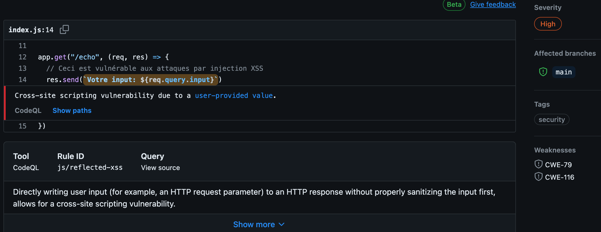

# Analyse du code smell

## Tester la faille XSS

Ce code contient une faille XSS, pour vous rendre compte du risque lancer l'application avec `npm install && npm run start`

Puis ouvrez un onglet sur l'url : `http://localhost:3000/echo?input=Tout%20c%27est%20bien%20pass%C3%A9%3Cscript%3Ealert(%22test%22)%3C/script%3E`

Normalement vous devriez comprendre que celui qui vous a partagez ce lien, aurais pu écrire n'importe quoi comme script.

## Comment initialisater CodeQL

Dans votre repository Aller dans `settings` -> `Code security and analysis` puis scroller jusqu'à `Code scanning` et activer `CodeQL analysis`

## Vulnérabilité remontée



## Comment exécuter ?

Il suffit d'activer le trigger de l'action à savoir un "push".

Cependant pour push il faut pouvoir avoir un commit.

Vous connaissez peut être les "dummy commit" qui sont des modifications mineurs, un espace par ci, juste pour pouvoir créer un commit.

Mais ici, on fait les choses proprement pourquoi faire un faux commit quand on peut faire un commit vide ?!

```bash
git commit --allow-empty -m "Commit totalement vide !"
```

Il suffit alors de push tout ça vers Github

```bash
git push
```

Il reste à aller voir l'interface de Github pour observer le résultat dans les actions.
